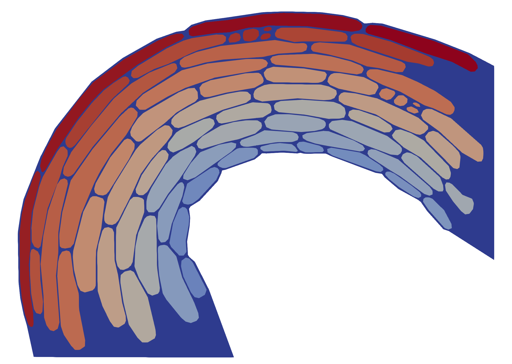

# Exploring growth mechanics of apical hook morphogenesis in Arabidopsis using FEM

> Sara Raggi, Hemamshu Ratnakaram, Özer Erguvan, Asal Atakhani, Adrien Heymans, Manuel Petit, Marco Marconi, Sijia Liu, François Jobert,Thomas Vain, Siamsa M. Doyle, Krzysztof Wabnik, Stéphane Verger, and Stéphanie Robert.
> "The cuticle layer is developmentally regulated to enable anisotropic cell growth"

Using finite element modeling (FEM), we investigated the biomechanics underlying apical hook morphogenesis by simulating growth patterns based on wild-type and aberrant Arabidopsis mutants. 
Our control configuration started with a pre-formed apical hook mesh replicating the anatomical traits of the wild type, characterized by distinct gradients in cell length, such as longer cells on the outer curvature and shorter ones on the inner side. The mechanical properties of this baseline scenario featured high anisotropy and a high strain rate. 
Subsequently, we simulated three aberrant scenarios, systematically altering the strain rate, the mechanical anisotropy, or both simultaneously.



## 1. About

This repository contains a Finite Element Model (FEM) for growth mechanics during apical hook maintenance phase in *Arabidopsis thaliana*. The FEM framework uses the [bvpy](https://gitlab.inria.fr/mosaic/bvpy/) library, and the mesh generation was performed with [GMSH](https://gmsh.info/).

## 2. Install

You can download the content of the repository using for instance the `git` command line tool

```bash
git clone https://github.com/SRobertGroup/2D-HypoHookFEM.git
cd 2D-HypoHookFEM
```

#### Requirements

- Python 3.9
- FEniCS 2019.1.0
- GMSH 4.11
- Bvpy-develop
- Paraview 5.11.1
- R 4.3.1

### From mamba/conda

>[!NOTE] 
> We recommend to use [Mamba](https://mamba.readthedocs.io/en/latest/installation/mamba-installation.html) to create a virtual environment and run the FEM script in it ([Anaconda](https://www.anaconda.com/download) works also)
>
> For more information on how to set-up conda, please check the [conda user guide](https://conda.io/projects/conda/en/latest/user-guide/install)

```{bash}
mamba env create -f conda/hook_env.yaml
mamba activate hook_env
```

## 3. Usage and Repository content


